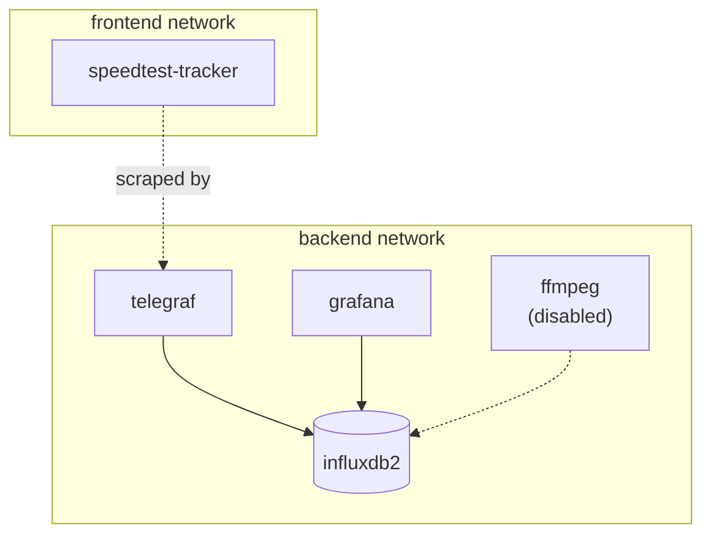

# Architecture

## Services

Everything is defined in [compose.yml](https://github.com/PiCommCapp/NIA-stream-dashboard/blob/main/compose.yml) under the Compose project name `stream-dashboard`.

| Service | Image | Networks | Notes |
|---|---|---|---|
| `influxdb2` | `influxdb:${INFLUXDB_VERSION}` | backend | Healthcheck via `influx ping`; seeded on first boot from `INFLUXDB_*` env vars |
| `telegraf` | built from `./telegraf` | backend | Mounts host `/etc`, `/proc`, `/sys`, `/var`, `/run` read-only under `/hostfs` for host-level metrics; runs with `NET_ADMIN` for ICMP ping |
| `grafana` | `grafana/grafana:${GRAFANA_VERSION}` | backend, frontend | Provisioned from `./grafana/datasources` and `./grafana/dashboards`; depends on `influxdb2` and `telegraf` |
| `speedtest-tracker` | `lscr.io/linuxserver/speedtest-tracker` | backend, frontend | Runs its own scheduled speed tests (`SPEEDTEST_SCHEDULE`) independent of Telegraf; Telegraf scrapes its results API |
| `ffmpeg` | built from `./ffmpeg` | backend, frontend | Currently commented out in `compose.yml`; see [FFmpeg / Vimeo](ffmpeg-vimeo.md) |

## Networks

Two Compose networks separate concerns:

- **`backend`** — internal data plane (Telegraf → InfluxDB, Grafana → InfluxDB)
- **`frontend`** — services with a browser/API-facing port (Grafana, Speedtest Tracker, and eventually FFmpeg for debugging access)

## Volumes

All named volumes are prefixed `NSD_` (NIA Stream Dashboard) to make them identifiable with `docker volume ls`:

| Volume | Used by | Contents |
|---|---|---|
| `NSD_influxdb2-data` | influxdb2 | Time-series data |
| `NSD_influxdb2-config` | influxdb2 | InfluxDB's own config, generated on setup |
| `NSD_grafana_data` | grafana | Grafana's internal SQLite DB (users, sessions) |
| `NSD_speedtest-tracker-data` | speedtest-tracker | SQLite DB of speed test results |

`make clean` removes every `NSD_*` volume, so back up anything you need before running it.

## Data model

Everything ends up in a single InfluxDB bucket as separate **measurements**, keeping the schema flat and easy to query from Grafana with Flux:

| Measurement | Written by | Key fields |
|---|---|---|
| `PingChecks` | Telegraf `inputs.ping` | `average_response_ms`, `percent_packet_loss` |
| `NetworkInterfaces` | Telegraf `inputs.net` | `bytes_sent`, `bytes_recv`, `err_in`, `err_out`, `drop_in`, `drop_out` |
| `NetworkStats` | Telegraf `inputs.netstat` | `tcp_established`, `tcp_listen`, `tcp_time_wait`, etc. |
| `VimeoResponse` | Telegraf `inputs.net_response` | `response_time` (TCP connect time to vimeo.com:443) |
| `VimeoDNSQuery` | Telegraf `inputs.dns_query` | `query_time_ms` |
| `SpeedTest` | Telegraf `inputs.http` (Speedtest Tracker API) | `ping`, `download`, `upload`, `packetLoss`, `isp`, `server_name` |
| `WP1` … `WP8` | Telegraf `inputs.http` (Web Presenter API) | `status`, `videoBitrate`, `platform`/`name`, `cache` |
| `stream` (planned) | `scripts/vimeo-exporter.py` | `healthy`, `bitrate`, `codec`, `width`, `height`, `fps`, `failure_reason` |

See [Telegraf](telegraf.md) for exactly how each input is configured, and [InfluxDB](influxdb.md) for organization/bucket conventions.
