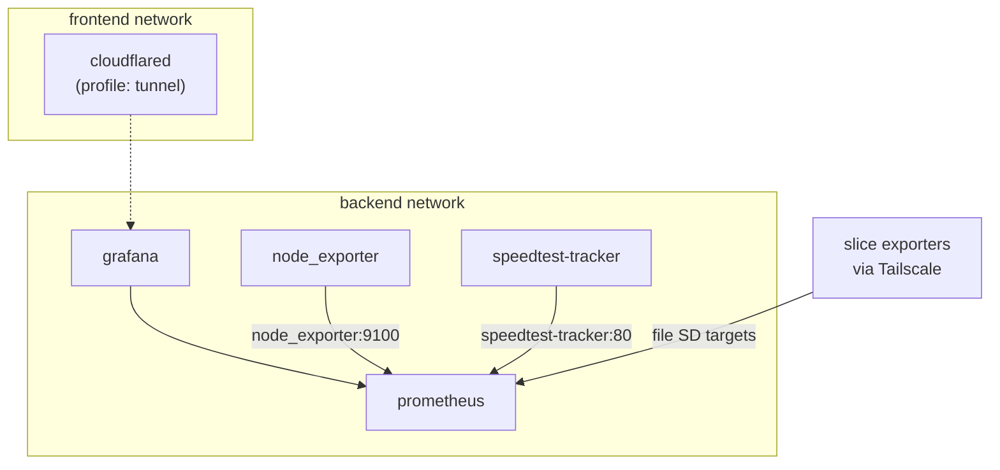

# Architecture

Everything is defined in `compose.yml` under the Compose project name
`monitoring-nia`. The [Decisions](decisions.md) page summarizes the architecture
choices that keep the server stack, endpoint stack, Cloudflare, and Tailscale
paths separated.

## Services

| Service | Image | Networks | Notes |
| --- | --- | --- | --- |
| `prometheus` | `prom/prometheus` | backend | Scrapes Cherry and slice targets; TSDB on `NSD_prometheus_data` |
| `grafana` | `grafana/grafana` | backend, frontend | Provisioned datasource + dashboards; LAN port published |
| `node_exporter` | `quay.io/prometheus/node-exporter` | backend | `pid: host` + rootfs bind; scraped as `node_exporter:9100` |
| `speedtest-tracker` | `lscr.io/linuxserver/speedtest-tracker` | backend | Local Ookla results; `/prometheus` scrape |
| `cloudflared` | `cloudflare/cloudflared` | frontend | Profile `tunnel` only; needs `TUNNEL_TOKEN` |

## Networks

| Network | Purpose |
| --- | --- |
| `backend` | Internal stack traffic (Prometheus ↔ Grafana) |
| `frontend` | Tunnel-facing edge (`cloudflared`, Grafana dual-homed) |

Networks are project-scoped (not shared bare `frontend`/`backend` names) so this
stack does not collide with other Compose projects on Cherry.

## Volumes

| Volume | Contents |
| --- | --- |
| `NSD_prometheus_data` | Prometheus TSDB |
| `NSD_grafana_data` | Grafana internal DB |
| `NSD_speedtest_tracker_data` | Speedtest Tracker application data |

## Data model

Prometheus metrics with labels. Scrape jobs today:

| Job | Target | Purpose |
| --- | --- | --- |
| `prometheus` | `localhost:9090` | Self-metrics |
| `node` | `node_exporter:9100` | Cherry host (`instance=cherry`) |
| `node_remote` | `*.taild08b87.ts.net:9100` | Slice hosts over Tailscale |
| `blackbox` | `*.taild08b87.ts.net:9115` | Blackbox exporter metrics |
| `probe_icmp` | blackbox `/probe` | ICMP via each slice |
| `speedtest` / `speedtest_remote` | Tracker `:8765/prometheus` | Ookla bandwidth |

See [Prometheus](prometheus.md) for file SD, Access headers, health checks, and
reload. Alertmanager is a later epic, not part of the MVP stack.

Endpoint Pis run a separate Compose template (`cloudflared` + `node_exporter` +
`blackbox_exporter` + `speedtest-tracker`). See [Slice](slice.md).
