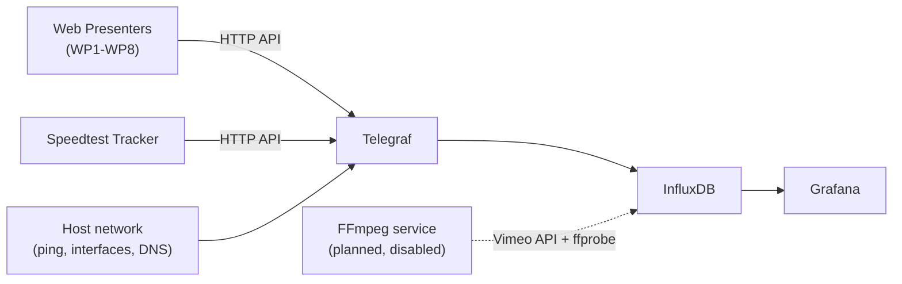

# NIA Stream Dashboard

NIA Stream Dashboard is a self-hosted monitoring platform for live-streaming infrastructure. It watches network health, ISP speed, and up to eight Blackmagic Web Presenter encoders, and is growing a Vimeo/FFmpeg stream probe to verify the health of outbound streams themselves.

The entire stack runs as a Docker Compose project named `stream-dashboard`.

## Architecture at a glance

| Component | Role |
|---|---|
| **Telegraf** | Polls devices and the host every 10 seconds and writes metrics to InfluxDB |
| **InfluxDB 2** | Time-series store for all metrics |
| **Grafana** | Provisioned dashboards for network health, speed tests, and device status |
| **Speedtest Tracker** | Runs scheduled ISP speed tests and exposes them over HTTP |
| **FFmpeg service** | Not yet enabled — will probe Vimeo HLS streams with `ffprobe` and publish stream health metrics |

## Where to go next

- New to the project? Start with [Getting Started](user/getting-started.md).
- Setting up environment variables or new devices? See [Configuration](user/configuration.md).
- Working on the dashboards or the data pipeline? See the [Developer Guide](developer/architecture.md).
- Curious about known issues and what's being built next? See the [Roadmap](roadmap.md).
