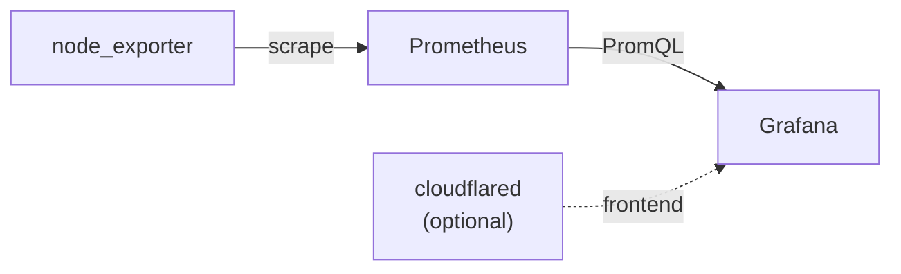

# NIA Monitoring

Central monitoring server stack for live-streaming infrastructure. Deployed on
**Cherry** (Picomms). Metrics are scraped with Prometheus and visualised in
Grafana. M1 is complete: Cherry's local host metrics are live. Raspberry Pi
exporters are scraped over Cloudflare hostnames (see [Prometheus](developer/prometheus.md)).

Compose project name: `monitoring-nia`.

## Architecture at a glance

| Component | Role |
| --- | --- |
| **Prometheus** | Scrapes local targets and stores TSDB data |
| **Grafana** | Provisioned PromQL dashboards |
| **node_exporter** | Cherry host CPU / memory / disk / network metrics |
| **cloudflared** | Optional Cloudflare Tunnel for Grafana (profile `tunnel`) |

The Vimeo/ffprobe exporter is planned as second-generation work — auth notes live
in [FFmpeg / Vimeo](developer/ffmpeg-vimeo.md).

## Project direction

The [Decisions](developer/decisions.md) page summarizes the architecture choices
we have locked. The repository-root `refactor.md` is the complete decision record,
while `refactor-plan.md` defines milestone order and done criteria.

## Where to go next

- New to the project? Start with [Getting Started](user/getting-started.md).
- Environment variables: [Configuration](user/configuration.md).
- Tunnel / DNS runbook: [Cloudflare](cloudflare.md).
- RPi endpoint template: [Slice](developer/slice.md).
- Stack layout: [Architecture](developer/architecture.md).
- Scrapes and reloads: [Prometheus](developer/prometheus.md).
- Milestones and deferred work: [Roadmap](roadmap.md).
