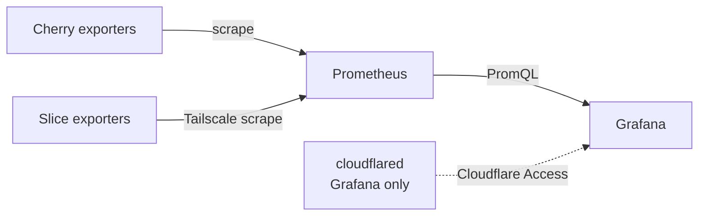

# NIA Monitoring

Central monitoring server stack for live-streaming infrastructure. Deployed on
**Cherry** (Picomms). Metrics are scraped with Prometheus and visualised in
Grafana. Cherry and Raspberry Pi endpoint metrics are scraped into one
Prometheus server; Grafana is published for operators through Cloudflare Access.

Compose project name: `monitoring-nia`.

## Architecture at a glance

| Component | Role |
| --- | --- |
| **Prometheus** | Scrapes Cherry plus slice targets and stores TSDB data |
| **Grafana** | Provisioned PromQL dashboards for Cherry, fleet hosts, and speed tests |
| **node_exporter** | Host CPU / memory / disk / network metrics |
| **blackbox_exporter** | Endpoint probe support from the slice stack |
| **Speedtest Tracker** | Ookla results exported to Prometheus |
| **cloudflared** | Optional Cloudflare Tunnel for Grafana (profile `tunnel`) |

## Project direction

The MVP server stack is in place. [Decisions](developer/decisions.md) summarizes
the architecture choices; [Roadmap](roadmap.md) tracks later epics such as
alerting and the separate Vimeo HLS exporter.

## Where to go next

- New to the project? Start with [Getting Started](user/getting-started.md).
- Environment variables: [Configuration](user/configuration.md).
- Tunnel / DNS runbook: [Cloudflare](cloudflare.md).
- RPi endpoint template: [Slice](developer/slice.md).
- Stack layout: [Architecture](developer/architecture.md).
- Scrapes and reloads: [Prometheus](developer/prometheus.md).
- Milestones and deferred work: [Roadmap](roadmap.md).
