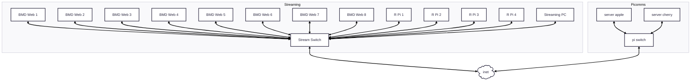
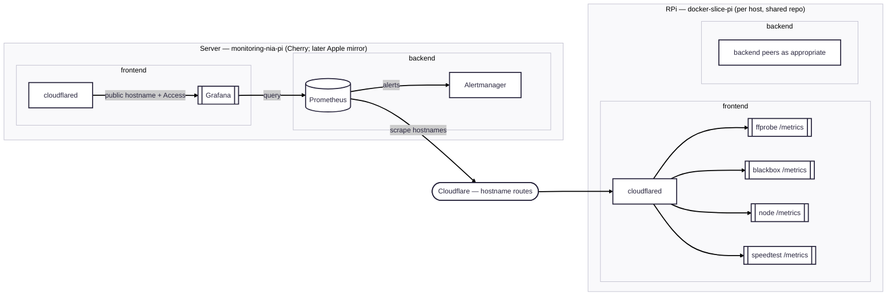

# Monitoring System — Refactor Plan

Architecture and locked decisions for the monitoring rebuild. For sequencing and
milestones, see [`refactor-plan.md`](refactor-plan.md).

## Why we're changing

The project started as a single Docker Compose stack limited to the streaming
network (Telegraf → InfluxDB → Grafana, all on one host). We're now thinking
about monitoring at a larger scale, across multiple hosts joined by **Cloudflare
Tunnels**, with the central Grafana/Prometheus stack on Picomms servers
(**Cherry** now; **Apple** later as a mirror).

That shift drives three decisions:

1. **Move from InfluxDB to Prometheus.** The pull/scrape model fits a fleet of
   hosts far better than InfluxDB's push model, and the exporter ecosystem
   (blackbox, node, json, speedtest) replaces most of our bespoke Telegraf
   config. Labels also remove the hardcoded `WP1`–`WP8` pain.
2. **Split server vs endpoint stacks.** This repo is the **server** stack.
   Raspberry Pis run a separate shared template (`docker-slice-pi`) with a
   unique `.env` per host.
3. **Central Prometheus, many exporters.** We do **not** run a Prometheus server
   on every endpoint — each endpoint exposes lightweight `/metrics` exporters.
   **Scrapes use Tailscale** (MagicDNS + published exporter ports). **Grafana
   for humans** uses Cloudflare Tunnel + Access (`mon-grafana.cothrom.ie`).
   Slice `cloudflared` is optional.

## Repo layout

| Repo | Role | Contents |
| --- | --- | --- |
| **`monitoring-nia-pi`** (this repo) | **Monitoring server stack** + docs | Compose for Prometheus, Grafana, Alertmanager, and **`cloudflared`**, plus scrape config, alert rules, and provisioned dashboards. Deployed on **Cherry** (primary). Later, **Apple** runs a **mirror** of the same stack (backup server). Also: MkDocs → GitHub Pages, Cloudflare guide, and (later) the ffprobe exporter source/image. Greenfield: rebuild without preserving the old Influx/Telegraf layout. |
| **`docker-slice-pi`** | Reusable endpoint stack for the **Raspberry Pis** | One shared repo on each RPi with a unique `.env` (incl. that host's tunnel token). **First-gen Compose:** `cloudflared`, `node_exporter`, `blackbox_exporter`. **Second-gen:** ffprobe exporter (image from this repo), then other exporters as needed. The Streaming PC is out of scope for now. |
| **`docker-cherry-pi`** (workspace reference) | Cherry host stack — **not** this monitoring service | Existing Cherry Docker repo, kept in the workspace as a reference. Eventually it holds only services **unique to Cherry**. NIA monitoring does **not** live there — that is this repo. Same idea later for Apple: host-unique services stay in an Apple host stack; the monitoring mirror is still `monitoring-nia-pi`. |

Per-host secrets for the monitoring stack stay in each server's `.env` (Cherry
vs Apple tokens, etc.). Old Telegraf pieces in this repo are replaced in place
as the Prometheus server stack lands; endpoint exporters belong only in
`docker-slice-pi`.

## Physical Layout

## Logical layout (target)

Prometheus **pulls**: arrows below point from Prometheus, via Cloudflare
Tunnels, to each exporter it scrapes. Each stack runs its own `cloudflared`
container (token-managed, remotely configured in Zero Trust). The ffprobe
exporter exposes its own `/metrics` endpoint directly — it is no longer routed
through Telegraf.

Every Compose stack uses two Docker networks (same names on both repos):

| Network | Purpose |
| --- | --- |
| **`frontend`** | The cloudflared edge network. Only services that Cloudflare should reach (or that must talk *to* Cloudflare) attach here. Prefer no published host ports — `cloudflared` reaches peers by Compose service name on this network. |
| **`backend`** | Internal stack traffic that must not be tunnel-facing. Attach services here as appropriate (e.g. Prometheus ↔ Alertmanager, Grafana ↔ Prometheus, exporters talking only among themselves). |

`cloudflared` sits on **`frontend` only**. Services that are both published *and*
need internal peers (e.g. Grafana) attach to **both** networks where that is
appropriate.

Prometheus and Alertmanager live on `backend` (and Prometheus may also join
`frontend` only if something local must reach it). Grafana is dual-homed so
`cloudflared` can publish it. Endpoint exporters live on `frontend` so that
host's `cloudflared` can map tunnel hostnames to Compose service names.

### Cloudflare as the data link

Preference: **official `cloudflare/cloudflared` Docker containers** in each
Compose stack — not host-installed binaries — so tunnel lifecycle matches the
rest of the stack (`just up-tunnel` / `just down`, backed by Docker Compose).

**Scrape topology (decided): Tailscale MagicDNS + published ports.** Prometheus
on Cherry scrapes `http://<HOST_ID>.taild08b87.ts.net:9100` and `:9115`. Slice
stacks publish those ports; restrict with Tailscale ACLs / host firewall.

**Grafana topology:** Cloudflare Tunnel on Cherry only —
`mon-grafana.cothrom.ie` → `http://grafana:3000` behind Access
([`docs/cloudflare.md`](docs/cloudflare.md)).

| Side | Role |
| --- | --- |
| **`docker-slice-pi` (each RPi)** | `node_exporter` / `blackbox_exporter` with host ports `9100` / `9115`. Optional `cloudflared` (`profiles: [tunnel]`). |
| **`monitoring-nia-pi` (server)** | Prometheus scrapes Tailscale; Grafana published via Cherry `cloudflared` + Access. |

## What changes, concretely

### ffprobe exporter (second generation)

Not part of the first working path. After Cherry local metrics, the slice
template, and remote node/blackbox scrapes work, the Vimeo/ffprobe path becomes
a long-lived Prometheus exporter:

- Drop `influxdb-client`; add `prometheus-client` in `pyproject.toml`.
- Run the probe on a background interval (keep the `run.sh` interval idea) and
  serve `/metrics` — **do not** probe synchronously on scrape, since `ffprobe`
  on an HLS stream can take seconds and would time out scrapes.
- Numeric fields (`width`, `height`, `fps`, `bitrate`, `duration`, `api_ms`,
  `probe_ms`, health bools) become gauges.
- **Strings have no Prometheus value type.** `codec`, `audio_codec`,
  `failure_reason` become labels on a `stream_info{...} 1` gauge. The same
  pattern applies to Web Presenter `status`/`platform` and Speedtest
  `isp`/`server_name` when those land later.

### Prometheus-friendly service swaps (phased)

**First generation (slice template + link):**

- **Network / host:** `node_exporter` + `blackbox_exporter` replace Telegraf ping,
  DNS, net_response, and host net stats for the initial remote path.

**Later / second generation:**

- **Speedtest:** scrape-native exporter (replaces Speedtest Tracker + Telegraf).
- **Web Presenters:** `json_exporter` against device HTTP APIs.
- **ffprobe / Vimeo:** bespoke exporter (see above).
- Telegraf can be retired entirely once the above cover what we still need.

### Dashboards

- First dashboard is **local Cherry metrics**, then extend for remote node +
  blackbox once M4 works. Stream/ffprobe panels wait for second generation.
- Old Flux boards are a full PromQL rewrite when we mirror them — optional
  notes in `docs/dashboards.md` only if useful.
- Labels let us collapse hardcoded `WP1`–`WP8` panels later when WP metrics exist.

### Alerting

- Introduced via Alertmanager in this server stack. Rules live under
  `prometheus/rules/` and grow organically; each rule documented in
  `docs/alerting.md`. Good first alerts: stream unhealthy, `up == 0` for any
  exporter, ISP speed drop.

### Documentation deliverables (master repo)

| Doc | Purpose |
| --- | --- |
| **`docs/cloudflare.md`** | **Required.** Operator guide for hostname-based tunnels on `cothrom.ie`: Zero Trust prerequisites, remotely managed tunnels, per-host `TUNNEL_TOKEN`s, hostname → Compose service ingress on **`frontend`**, `mon-grafana.cothrom.ie` + Access, per-exporter scrape hostnames with a `mon-` prefix under `cothrom.ie`, DNS, and `.env` placement. Source of truth for tunnel config — Compose only consumes tokens and service names. |
| `docs/dashboards.md` | Capture current Grafana layout before the PromQL rewrite. |
| `docs/alerting.md` | Document each alert rule as it is added. |

`docs/cloudflare.md` should be written **before** wiring tunnels into
`docker-slice-pi` / this server stack, so stack PRs follow a settled pattern
instead of inventing one.

## Operational notes

- **Retention:** Prometheus default (~15 days) is fine; no long-term store
  needed for now.
- **Service discovery:** static Prometheus scrape configs using Tailscale
  MagicDNS names + ports for each RPi exporter; revisit later if host count
  grows.
- **Compose networks:** every stack declares `frontend` and `backend`.
  `cloudflared` is `frontend`-only when used. Grafana is dual-homed. Slice
  exporters publish host ports `9100`/`9115` for Tailscale scrapes.
- **Security:** exporters serve unauthenticated `/metrics` — restrict with
  Tailscale ACLs / host firewall; do not expose them on the public internet.
  Grafana stays behind Cloudflare Access on `mon-grafana.cothrom.ie`. Secrets
  live in each host's `.env` (never in the master repo).
- **cloudflared image:** pin a known `cloudflare/cloudflared` tag in Compose
  (avoid floating `:latest`). Remotely managed tunnels (`TUNNEL_TOKEN`) for
  Grafana (and optional slice debug).
- **Migration:** greenfield — Topple the old Influx/Telegraf design; build the
  server stack on Cherry (Apple mirror later). Historical InfluxDB data does
  not carry over.

## Decisions (locked)

- **Scrape routing:** Tailscale MagicDNS + published exporter ports.
- **Grafana routing:** Cloudflare Tunnel hostname `mon-grafana.cothrom.ie` +
  Access. Optional `mon-node-*` / `mon-blackbox-*` hostnames are not the scrape
  path.
- **Server stack:** this repo (`monitoring-nia-pi`) deploys the central
  Prometheus/Grafana stack. Primary host is **Cherry**; **Apple** will later
  run a **mirror** of the same stack (backup server). Unique `.env` per server.
  Host-unique services on Cherry stay in **`docker-cherry-pi`** (workspace
  reference for now) — that repo does **not** run this monitoring service.
- **Endpoint targets:** Raspberry Pis run `docker-slice-pi`. Streaming PC
  deferred (own stack or nothing) until we decide to collect metrics there.
- **`docker-slice-pi`:** one shared repo across RPis; unique `.env` per host.
- **Docs:** live in this repo and publish to GitHub Pages.
- **Build order:** Cherry local metrics + dashboard → slice template → remote
  node/blackbox scrapes → **then** ffprobe (second gen). Apple mirror after the
  primary path is solid.
- **Destination:** central monitoring on Picomms servers + Prometheus; not an
  incremental keep-the-old-stack migration.
- **Freedom to rebuild:** stack not launched — rewrite Compose/docs freely.

## Repo names (decided)

- Monitoring server stack + docs + (later) ffprobe exporter: **`monitoring-nia-pi`**.
- Reusable RPi endpoint stack: **`docker-slice-pi`**.
- Cherry host-unique services: **`docker-cherry-pi`** (reference in workspace;
  not where NIA monitoring lives).

## Open questions

- Whether Web Presenter / blackbox probes run on every RPi or a subset that
  can reach the streaming LAN devices.
- Apple mirror details (active/passive, scrape ownership, Grafana hostname) —
  defer until the Cherry path works; same Compose, different `.env`.
