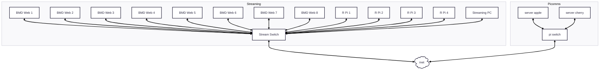
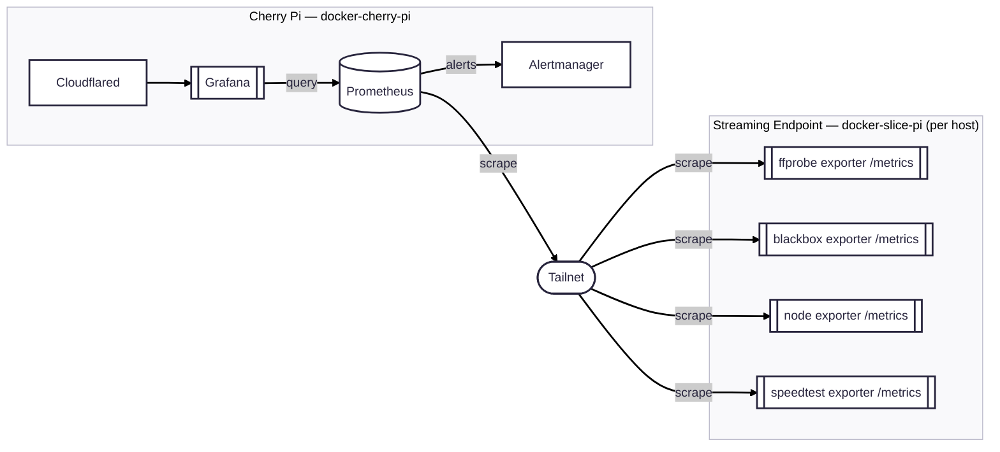

# Monitoring System — Refactor Plan

## Why we're changing

The project started as a single Docker Compose stack limited to the streaming
network (Telegraf → InfluxDB → Grafana, all on one host). We're now thinking
about monitoring at a larger scale, across multiple hosts joined by Tailscale,
with the Grafana front end moved off to a remote machine (Cherry Pi).

That shift drives three decisions:

1. **Move from InfluxDB to Prometheus.** The pull/scrape model fits a fleet of
   hosts on a tailnet far better than InfluxDB's push model, and the exporter
   ecosystem (blackbox, node, json, speedtest) replaces most of our bespoke
   Telegraf config. Labels also remove the hardcoded `WP1`–`WP8` pain.
2. **Break the monolith into reusable per-host stacks.** Instead of one big
   compose file, each host runs a small stack from its own repo, configured by a
   unique `.env`.
3. **One central Prometheus, many exporters.** We do **not** run a Prometheus
   server on every endpoint — each endpoint exposes lightweight `/metrics`
   exporters, and a single central Prometheus on Cherry Pi scrapes them all over
   Tailscale.

## Repo layout (three repos)

| Repo | Role | Contents |
| --- | --- | --- |
| **`monitoring-nia-pi`** (this repo, renamed from `NIA-stream-dashboard`) | Master / source of truth | Central documentation (MkDocs) + the FFmpeg/ffprobe stream-probe exporter (source + image). The one thing we actually build; everything else is off-the-shelf. |
| **`docker-slice-pi`** | Reusable endpoint stack (RPis / streaming hosts) | Compose for the exporters that sit on each streaming endpoint — blackbox exporter, node exporter, the ffprobe exporter (image from `monitoring-nia-pi`), and a speedtest exporter. Deployed per host with a unique `.env`. |
| **`docker-cherry-pi`** (the existing Cherry Pi docker repo) | Central stack on Cherry Pi | Compose for Prometheus, Grafana, Alertmanager, Cloudflared, and Tailscale, plus scrape config, alert rules, and provisioned dashboards. |

Rationale: the ffprobe exporter is the only bespoke artifact, so it stays with
the docs. Grafana/Prometheus/blackbox/speedtest are all stock images and belong
to whichever host runs them. Keeping them out of the master repo avoids
rebuilding the monolith we're trying to split.

The current `grafana/` and `telegraf/` folders in this repo migrate out to the
host stack repos.

## Physical Layout



## Logical layout (target)

Prometheus **pulls**: arrows below point from Prometheus, via the tailnet, to
each exporter it scrapes. The ffprobe exporter exposes its own `/metrics`
endpoint directly — it is no longer routed through Telegraf.



## What changes, concretely

### ffprobe exporter (the one build task)

Today `scripts/vimeo-exporter.py` **pushes** to InfluxDB. It becomes a
long-lived Prometheus exporter:

- Drop `influxdb-client`; add `prometheus-client` in `pyproject.toml`.
- Run the probe on a background interval (keep the `run.sh` interval idea) and
  serve `/metrics` — **do not** probe synchronously on scrape, since `ffprobe`
  on an HLS stream can take seconds and would time out scrapes.
- Numeric fields (`width`, `height`, `fps`, `bitrate`, `duration`, `api_ms`,
  `probe_ms`, health bools) become gauges.
- **Strings have no Prometheus value type.** `codec`, `audio_codec`,
  `failure_reason` become labels on a `stream_info{...} 1` gauge. The same
  pattern applies to Web Presenter `status`/`platform` and Speedtest
  `isp`/`server_name`.

### Prometheus-friendly service swaps

- **Speedtest:** replace Speedtest Tracker (scraped via Telegraf HTTP) with a
  scrape-native exporter (e.g. `speedtest-exporter`) — removes a service.
- **Web Presenters:** use `json_exporter` against the existing device HTTP APIs
  instead of the eight hand-written `inputs.http` blocks.
- **Network checks:** `blackbox_exporter` replaces `inputs.ping`,
  `inputs.dns_query`, and `inputs.net_response`; `node_exporter` replaces
  `inputs.net` / `inputs.netstat`. Telegraf can likely be retired entirely.

### Dashboards

- All existing panels are Flux and must be rewritten in PromQL against the new
  Prometheus datasource — this is a full rewrite, not a datasource swap.
- The current layout is roughly good, so **document it first**
  (`docs/dashboards.md`) before rebuilding, to avoid losing structure.
- Labels let us collapse the hardcoded `WP1`–`WP8` panels into a single
  template-variable-driven view.

### Alerting

- Introduced via Alertmanager in `docker-cherry-pi`. Rules live under
  `prometheus/rules/` and grow organically; each rule documented in
  `docs/alerting.md`. Good first alerts: stream unhealthy, `up == 0` for any
  exporter, ISP speed drop.

## Operational notes

- **Retention:** Prometheus default (~15 days) is fine; no long-term store
  needed for now.
- **Service discovery:** static scrape configs using Tailscale MagicDNS names
  are fine at this scale; revisit `http_sd` off the tailnet device list later.
- **Security:** exporters serve unauthenticated `/metrics` — bind them to the
  tailnet interface (not `0.0.0.0`/LAN), restrict scraping with Tailscale ACLs,
  keep Grafana auth on behind Cloudflared, and keep per-host secrets in each
  host's `.env` (never in the master repo).
- **Migration:** run old and new stacks in parallel during cutover; historical
  InfluxDB data does not carry over to Prometheus.

## Repo names (decided)

- Master / docs + ffprobe exporter: **`monitoring-nia-pi`** (rename of this repo).
- Central stack on Cherry Pi: **`docker-cherry-pi`**.
- Reusable endpoint stack on the RPis: **`docker-slice-pi`**.

## Open questions

- Do near-identical streaming hosts share one `docker-slice-pi` (templated by a
  unique `.env` per host) or get copies? Sharing is preferred once there's more
  than one.
```
